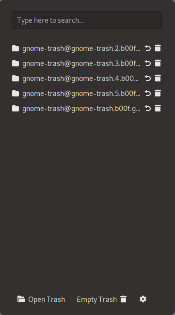

If you are obsessed with the Gnome desktop, as I am, and you want a clean desktop without any icons,
you can use the [Gnome Trash](https://github.com/b00f/gnome-trash) extension to manage the trash items.

With the help of the Gnome Trash extension you can manage your trash items and open or empty your trash folder.
You can also easily search for items inside the trash.

## Additional Features

- It's powered by TypeScript.
- Sorting trash items by "Deleted time" or "file name"
- Activation behavior: Open, Restore or permanently delete the file
- Hiding the button when trash is empty

## Installation

To install the latest release, visit Gnome Trash on the [Official GNOME Extensions](https://extensions.gnome.org/extension/4410/gnome-trash/) page.
