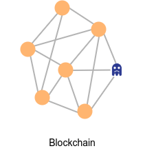

Satoshi Nakamoto didn’t mention that Bitcoin is a decentralized application in [Bitcoin](https://bitcoin.org/bitcoin.pdf) White paper. Indeed, he emphasized bitcoin is a “distributed peer-to-peer system”. Decentralization is a word that we hear it a lot recently to describe blockchain technology. But is the blockchain a decentralized application? What is the difference between a distributed and decentralized system?

In terms of computation, we can design and architect software in a monolithic or distributed way. Let’s talk more about it.

## Monolithic Architecture

_A monolithic application describes a single-tiered software application in which the user interface and data access code are combined into a single program from a single platform._ [^1]

You are most probably using your web browser to read this post. A browser is a good example of Monolithic software. A monolithic software can easily develop, test, and release. However, they can’t scale. In monolithic software, everything is tight together. Any change in any part of the software needs to rebuild and release of the whole software.

If you are going to build a trading platform or file-sharing system with a monolithic architecture, rethink about it!

## Distributed Architecture

A distributed application is hard to develop, test, and deploy. It has many nodes, and each node is fully independent. All nodes work together by sending messages through the network. Netflix is a good example of a Distributed Application. It contains dozens of microservices that each [microservice](https://microservices.io/) has Single Responsibility.

In my point of view, distributed software has two major categories: **Orchestrated Distributed system** and **Decentralized system**.

### Orchestrated Distributed system

_Consider a flock of sheep. Sheep are trying to eat grasses as much they can and, the shepherd with helping some dogs try to nerd them and make sure they don’t go to the neighborhood area and protect them from the wolf's attack. Sheep flock is an orchestrated distributed system. Sheep and dogs are the nodes in the system and the shepherd, as the orchestrator of this system, nerds and protects the flock._

In the orchestrated distributed systems, nodes are physically and geographically distributed worldwide. but still, there is a center point that deploys and manages the nodes. In case any error happens in the system, the orchestrator retires the faulty node and replaces it with a new node.

In order to deploy and manage the Orchestrated Distributed system, you need an orchestrator tool like Kubernetes: “Kubernetes is an open-source container-orchestration system for automating computer application deployment, scaling, and management.” [^2]

### Decentralized system

_A colony of ants is divided into different castes: workers, queens, and males. Worker ants leave the nest in search of food. Whenever a worker ant finds food, he returns to the nest and on his path he informs other ants. Ant colony is a decentralized system. Ants are the nodes in the network and the network has no orchestrator_

In a Decentralized system (or which I like to call: Non-Orchestrated Distributed system), there is no orchestration center. When a new node enters the network, it informs other nodes and other nodes try to help it join the network. Since there is no center for orchestrating the network, the network itself does the orchestration. [BitTorrent protocol](https://en.wikipedia.org/wiki/BitTorrent) or [Tor network](<https://en.wikipedia.org/wiki/Tor_(network)>) are good examples of a decentralized system.

The lack of orchestrator and security mechanism comes with a cost: A decentralized system is vulnerable to attacks like [Sybil attack](https://en.wikipedia.org/wiki/Sybil_attack).

## Blockchain

A decentralized system is vulnerable to Sybil attacks. Blockchain tries to solve this issue by adding the consensus mechanism. To have a consensus about any changes, all the nodes in the network should have the same state. This is the major difference between blockchain and decentralized system. In blockchain, all the nodes in the network have an identical state, and to move the old state to the new state, all the nodes should reach a level of consensus about that change. Since most of the nodes are loyal to the system, attackers can’t do anything, mostly because they are in a minority group.

Adding consensus comes with a cost. Blockchain can't be scalable. In decentralized system like Tor Network, adding more nodes, make the system more efficient and respondent, but in the blockchain this is not the case. Vitalik Buterin describes this as [Blockchain Trilemma](https://vitalik.ca/general/2021/04/07/sharding.html). The blockchain trilemma tells us that greater scalability is possible, but security, decentralization, or both will suffer as a consequence.

---

[^1]: [Wikipedia](https://en.wikipedia.org/wiki/Monolithic_application)
[^2]: [Wikipedia](https://en.wikipedia.org/wiki/Kubernetes)
