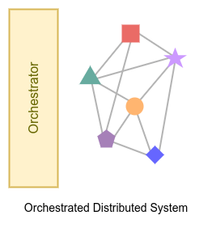
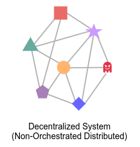

Satoshi Nakamoto didn't mention that Bitcoin is a decentralized application in the [Bitcoin](https://bitcoin.org/bitcoin.pdf) White Paper. In fact, he emphasized that Bitcoin is a “distributed peer-to-peer system.” Decentralization is a term that is often used to describe blockchain technology, but is the blockchain really a decentralized application? What is the difference between a distributed and decentralized system?

In terms of computation, software can be designed and architected in a monolithic or distributed way. Let's discuss this further.

## Monolithic Architecture

_A monolithic application describes a single-tiered software application in which the user interface and data access code are combined into a single program from a single platform._ [^1]

You are most likely using your web browser to read this post. A browser is a good example of Monolithic software.
Monolithic software is easy to develop, test, and release. However, it cannot scale.
In monolithic software, everything is tightly connected.
Any change in any part of the software requires a rebuild and release of the whole software.

If you are planning to build a trading platform or file-sharing system with a monolithic architecture,
you may want to reconsider your approach.

## Distributed Architecture

A distributed application is hard to develop, test, and deploy.
It consists of many independent nodes that work together by sending messages through the network.
Netflix is a good example of a Distributed Application. It contains dozens of [microservice](https://microservices.io/) , each with a Single Responsibility.

In my opinion, there are two main categories of distributed software: **Orchestrated Distributed system** and **Decentralized system**.

### Orchestrated Distributed system

_Imagine a flock of sheep. The sheep are trying to eat as much grass as possible, and the shepherd, with the help of some dogs, tries to herd them, prevent them from entering neighboring areas, and protect them from wolf attacks. The sheep flock is an orchestrated distributed system where the sheep and dogs serve as nodes, and the shepherd acts as the orchestrator, herding and protecting the flock._

In orchestrated distributed systems, nodes are physically and geographically distributed worldwide. However, there is still a central point that deploys and manages the nodes. If there is any error in the system, the orchestrator removes the faulty node and replaces it with a new one.

To deploy and manage an Orchestrated Distributed system, you need an orchestrator tool like Kubernetes: “Kubernetes is an open-source container-orchestration system for automating computer application deployment, scaling, and management.” [^2]

### Decentralized system

_Imagine a colony of ants divided into different castes: workers, queens, and males. Worker ants leave the nest in search of food. Whenever a worker ant finds food, it returns to the nest and informs other ants along the way. The ant colony is a decentralized system where the ants serve as nodes in the network, and there is no orchestrator._

In a Decentralized system (or what I like to call a Non-Orchestrated Distributed system), there is no orchestration center. When a new node enters the network, it informs other nodes and the other nodes try to help it join the network. Since there is no central orchestrator, the network itself handles the orchestration. [BitTorrent protocol](https://en.wikipedia.org/wiki/BitTorrent) or [Tor network](<https://en.wikipedia.org/wiki/Tor_(network)>) are good examples of decentralized systems.

The lack of an orchestrator and security mechanism comes at a cost: a decentralized system is vulnerable to attacks like [Sybil attack](https://en.wikipedia.org/wiki/Sybil_attack). However, decentralized systems are more scalable than centralized systems.

## Blockchain

A decentralized system is vulnerable to Sybil attacks, where an attacker creates multiple fake identities in order to manipulate the network. To address this issue, blockchain technology introduces a consensus mechanism to ensure that all nodes in the network have the same state (also known as a [replicated state machine](https://en.wikipedia.org/wiki/State_machine_replication)). This is a major difference between a decentralized system and a blockchain. In a blockchain, all nodes in the network have an identical state, and to transition from the old state to a new state, all nodes must reach a consensus about the change. Since most nodes are loyal to the system, attackers are usually in the minority and cannot effectively compromise the network.

However, adding a consensus mechanism comes with a cost. Blockchain systems are not as scalable as decentralized systems like the Tor Network, which become more efficient and responsive as more nodes are added. This trade-off between scalability, security, and decentralization is known as the [Blockchain Trilemma](https://vitalik.ca/general/2021/04/07/sharding.html), as described by Vitalik Buterin. The blockchain trilemma states that it is possible to increase scalability, but security, decentralization, or both will suffer as a consequence.

---

[^1]: [Wikipedia: Monolithic Application](https://en.wikipedia.org/wiki/Monolithic_application)
[^2]: [Wikipedia: Kubernetes](https://en.wikipedia.org/wiki/Kubernetes)
