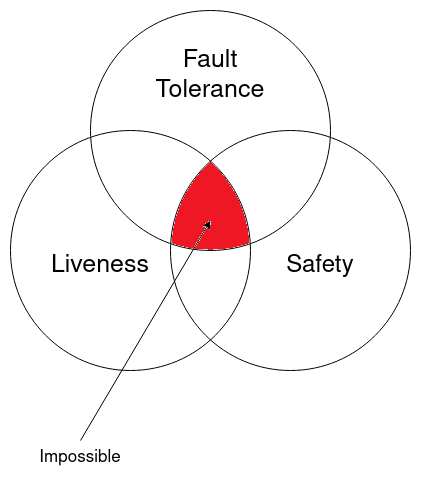
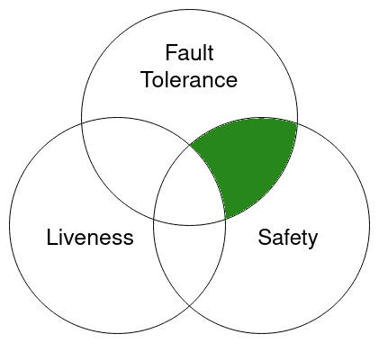
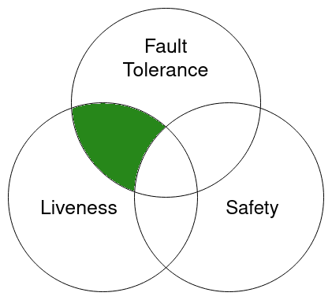
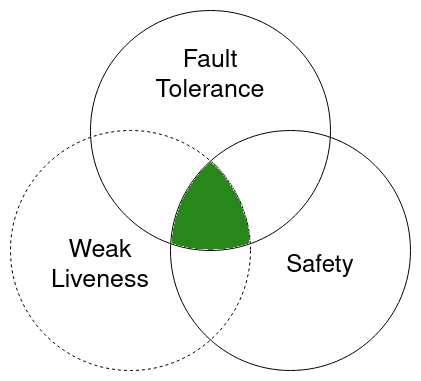
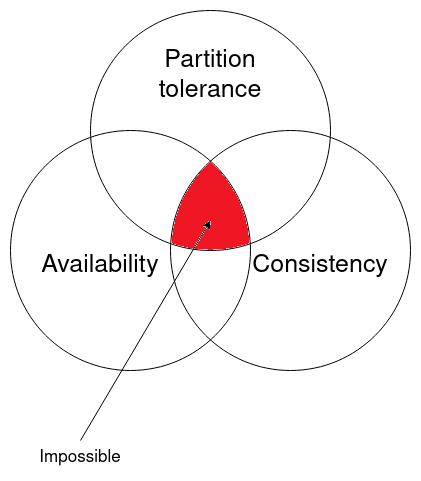
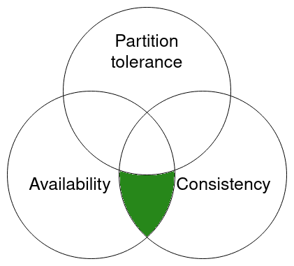
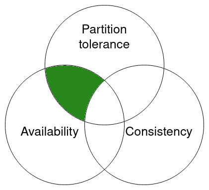

_Special thanks to David Rusu and John Leonard for suggestion and review._

## Definition

A protocol that solves Consensus problem[^1] must have thees properties:

- **Fault tolerance**

  If all the correct parties proposes the same value $$v$$, then any correct party must decide $$v$$. In other word, it ensures that a correct party doesn’t accept a value proposed by a faulty or byzantine node and implicitly it’s fault-tolerant. Some papers define it as "integrity" or "validity".

- **Safety**

  Every correct party must decide on the same value and there will be no fork in the system. A safety property asserts that something bad does not happen [^2]. Some papers define it as "agreement".

- **Liveness**

  Eventually every correct parties decides some value. A liveness property asserts that something good eventually does happen [^2]. Some papers define it as "termination".

## Network synchrony

It’s very important to define the network synchrony for any consensus model. Usually network synchrony is defined as _Complete Asynchronous_ or _Partial Synchronous_:

> A completely asynchronous model is one with no concept of real time. It is assumed that messages are eventually delivered and processes eventually respond, but no assumption is made about how long it may take.
>
> Other models introduce the concept of time and assume known upper bounds on message transmission time and process response time. [^2]

In the other word, in a Complete Asynchronous network, a message eventually will be received but it might take infinite time. But in Partially Synchronous networks, each party defines a timer for incoming messages and if the timer expires they can make a decision, for example inform other parties about it.

## FLP impossibility

The [“Impossibility of Distributed Consensus with One Faulty Process”](https://groups.csail.mit.edu/tds/papers/Lynch/jacm85.pdf) paper by Fisher, Lynch, and Paterson provides this formal statement with the proof:

> In this paper, we show the surprising result that no completely asynchronous consensus protocol can tolerate even a single unannounced process death

This statement that is well known as “FLP impossibility” strongly proves that:

> No consensus protocol is totally correct in spite of one fault.

Now the question is: does FLP impossibility mean we can’t have consensus at all?
Fortunately, the FLP paper answered this question:

> These results do not show that such problems cannot be “solved” in practice; rather, they point up the need for more refined models of distributed computing that better reflect realistic assumptions about processor and communication timings, and for less stringent requirements on the solution to such problems.

In other words, we can have consensus but with some assumptions. Let’s look at the assumptions that help us to have a consensus protocol:

### Liveness sacrificed

Some protocols like Paxos sacrifice Liveness or termination in order to achieve consensus. In Paxos there are situations where the protocol can never be terminated.

### Safety sacrificed

Bitcoin consensus protocol, which is known as the Nakamato consensus protocol, sacrifices safety over liveness. In Bitcoin at each height there might be more than one valid block in the network.

### Synchronous consensus

Most consensus protocols follow this assumption that the network is partially synchronous. Protocols like PBFT and Raft solve the consensus problem by defining an upper bound timer that prevents the system from waiting so long in case of a node failure.
From a FLP point of view, a synchronous consensus algorithm can provide safety but with a weaker liveness.

### Non-deterministic consensus

The FLP theorem applies only to deterministic protocols, it doesn’t apply to non-deterministic protocols. I misunderstood this concept (thanks to David Rusu for correcting me).

In deterministic consensus the behavior of a correct node is deterministically predictable by the sequence of events that the node receives. On the other hand, a non-deterministic consensus has a random function that can change the behavior of a node randomly, like a coin flip function.

Asynchronous Binary Byzantine Agreement protocols or in short ABBA solve the consensus problem by introducing a random oracle or coin tossing function.

## CAP theorem

CAP theorem is another interesting theorem in distributing systems. Based on the [Wikipedia](https://en.wikipedia.org/wiki/CAP_theorem) definition, CAP theorem states that any distributed data store can provide only two of the following three guarantees:

- **Consistency**

  Every read receives the most recent write or an error.

- **Availability**

  Every request receives a (non-error) response, without the guarantee that it contains the most recent write.

- **Partition tolerance**

  The system continues to operate despite an arbitrary number of messages being dropped (or delayed) by the network between parties.

Are the FLP impossibility and CAP theorem related? There is an interesting topic in [Quora](https://www.quora.com/Distributed-Systems/Distributed-Systems-Are-the-FLP-impossibility-result-and-Brewers-CAP-theorem-basically-equivalent) about this question. It is worth reading it. But in general they are not the same thing. The FLP impossibility theorem deals with the problem of achieving consensus in a distributed system, while the CAP theorem deals with the problem of achieving consistency in a distributed database.

Now let's look at the possible combination of CAP theorems.

### Consistency and availability

Protocols like PBFT, Paxos, ABBA and Raft are Consistent and Available if there is no network partitioning. If the network partitioned (for example half of the network can’t see the other half) then the consensus will be halted.

### Availability and partition tolerance

Bitcoin consensus protocol (Nakamoto consensus) sacrifices consistency in favor of availability. This is why bitcoin is resilient against network partitioning, but with the cost of forking.

---

[^1]:
    Consensus is defined on [Wikipedia](<https://en.wikipedia.org/wiki/Consensus_(computer_science)#Problem_description>) as below:

    > A consensus protocol tolerating halting failures must satisfy the following properties.
    >
    > **Termination**: Eventually, every correct process decides some value.
    >
    > **Integrity**: If all the correct processes proposed the same value v, then any correct process must decide v.
    >
    > **Agreement**: Every correct process must agree on the same value.

[^2]: [Chapter on Distributed Computing](https://www.microsoft.com/en-us/research/publication/2016/12/Distributed-Computing.pdf)
