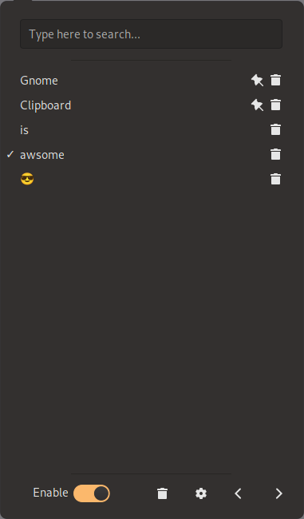

If you frequently work with clipboard content in Gnome and want a convenient way to manage it,
you can use the [Gnome Clipboard](https://github.com/foss-desk/gnome-clipboard) extension to manage the clipboard.

With the help of the Gnome Clipboard extension, you can manage the clipboard history:
pin important items, select specific ones, or remove items from the history.
Searching through clipboard history is also supported.

## Additional Features

- It's powered by TypeScript
- Clear the clipboard history
- Set a maximum size for the clipboard history
- Read clipboard by timer instead of API
- Sort clipboard items by "Copy time", "Recent usage" or "Most usage"
- Show a notification when selecting a clipboard item

## Installation

To install the latest release, visit Gnome Clipboard on the
[Official GNOME Extensions](https://extensions.gnome.org/extension/4422/gnome-clipboard/) page.
