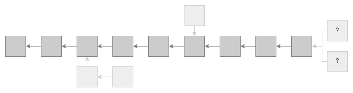
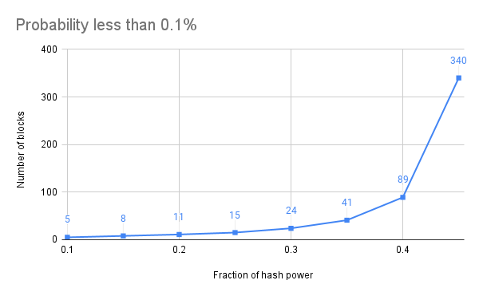
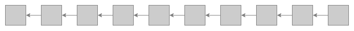
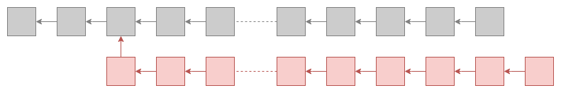
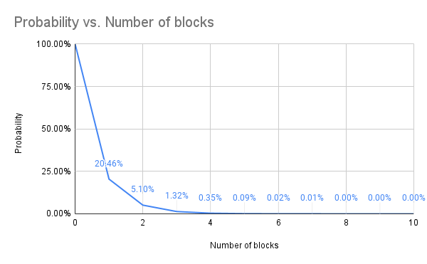

## Nothing at Stake attack

I am not sure where the term “Nothing at Stake” was minted, but I can only guess that it came from the
[Bitcoin community](https://bitcointalk.org/index.php?topic=897488.0). In Proof of Work blockchains,
a fork is inevitable, but only for a short period of time. Alternatively, a longer chain is a chain
that requires more work and therefore competing with it is hard, in the end, the longer chain will always win.

With the mindset of racing between forks, a [Proof of Stake](https://bitcointalk.org/index.php?topic=27787.0) blockchain
looks insecure since there is no work involved, only stake, therefore validators lose nothing if they bet on both forks.
This is known as “Nothing at Stake” attack.

### Always available

Nakamoto consensus protocol that is applied in Bitcoin, prioritizes liveness (availability) over safety (consistency).
In the model, the blockchain is always available but the safety is not guaranteed.
The below chart shows how an attacker can rewrite the blocks with the probability less than 0.1%.
For example an attacker with 10% of the mining power can rewrite the last 5 blocks (less than one hour), while attacker with 45% of mining power can rewrite the last 340 blocks (about 56 hours, or 2.5 days).[^1]

### Safety first

For a Proof of Stake blockchain, safety should be prioritized over liveness. In this case the safety is always guaranteed,
but the blockchain might not be available, specially when the network is partitioned.

In this model, a fork should **never** happen and there shouldn’t be a “Nothing at Stake” attack.
If a fork happens, it is the result of a bad implementation or even worse, the majority of the nodes
(with more than ⅔ of the total stake) are not loyal and honest.

### Slashing is wrong answer

The slashing mechanism is a wrong answer to a wrong question and brings much added complexity to the codebase.
Slashing mechanisms also raise many questions, such as: “In which fork are you going to slash the stakes?” or,
“Which fork are you going to choose as a main fork?”

## Long Range attack

Long range (or private chain) attack means the attacker creates a private branch starting from a point in the main blockchain.
This branch may contain different information and therefore the attacker can alter the history of the blockchain.

In Bitcoin, this kind of attack can be ignored by the honest node:

> Even if this is accomplished... nodes are not going to accept an invalid transaction as payment, and honest nodes
> will never accept a block containing them. [^1]

The below chart shows the probability of rewriting blocks by an attacker with 10% of mining power. [^1]

### It's deadly

The Long Range Attacks are a very [serious attack](https://bitcointalk.org/index.php?topic=1382241.0) for Proof of Stake blockchains.
Imagine in a real Proof of Stake blockchain, with random validators, you can obtain (or even buy) the private keys from the early validators.
If you have enough keys, you can reorganize a new fork from the early blocks (even from the genesis block!) and attack the blockchain.
If you consider that there is no work here, just stake, then reorganizing the blockchain is so easy.

Let's look at some solutions for overcoming long range attack:

### Algorand solution

In the [Algorand](https://www.algorand.com/) protocol users change their ephemeral participation keys used for every round. That is, after a user signs her message for round `r`, she deletes the ephemeral key used for signing, and fresh ephemeral keys will be used in future rounds. So even if in the future an adversary corrupts all committee members for a round `r`, as the users holding the super majority of stakes were honest in round `r` and erased their ephemeral
keys, no two distinct valid blocks can be produced for the same round. [^2]

Algorand's solution for preventing Long Range attack has some side effects: It added complexity to the codebase and since all participants should provide cryptographic proof for ephemeral keys per round, it increased the network bandwidth.

### Pactus solution

One way to prevent these attacks is to somehow bind the transaction into the main chain or fork.
In this way, we can put something from the main chain, like some part of the previous block hash, into the header of the transactions.
This mechanism is called [stamping the transaction](https://pactus.org/learn/transaction/stamping/). Stamping transactions helps to secure the blockchain against Long Range Attacks. Stamped transactions would be valid only on the main chain and therefore the attacker wouldn’t be able to use them in any other long fork.

### Checkpoint solution

Some blockchains suggest creating checkpoints to prevent Long Range attacks. This is a naive solution and doesn’t solve the problem.
First, the adversary also can create the checkpoints, and more importantly, how often a checkpoint should be created? In other words,
how long can the Long Range attack be?

---

[^1]: Part 11. Calculations of [Bitcoin Whitepaper](https://bitcoin.org/bitcoin.pdf)
[^2]: For more information look at [Algorand Blockchain Features Specification, Version 1.0](https://github.com/algorandfoundation/specs/blob/master/overview/Algorand_v1_spec-2.pdf)
