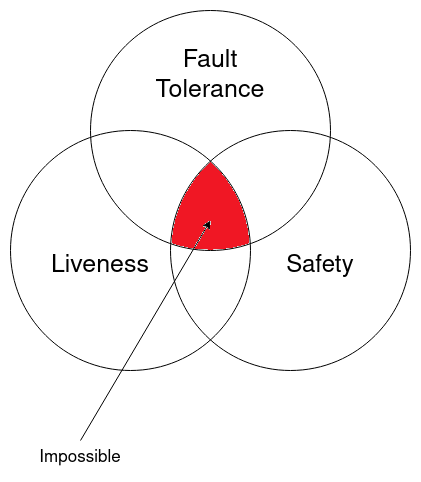
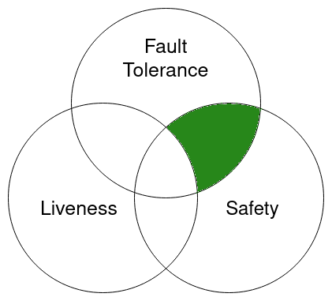
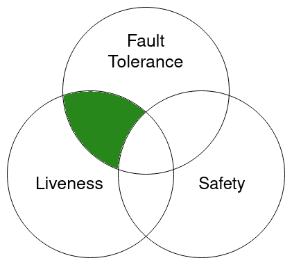
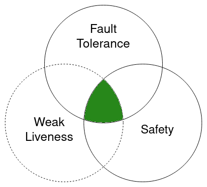
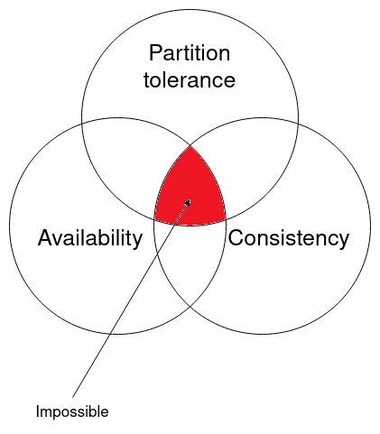
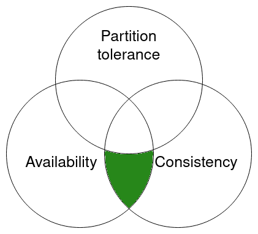
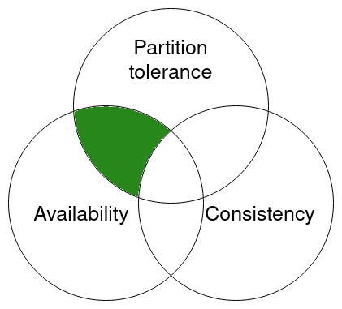

_Special thanks to David Rusu and John Leonard for suggestion and review._

## Consensus in Distributed Systems

Consensus is a critical problem in distributed systems, as it allows multiple parties to reach agreement on a
single value or set of values. A protocol that solves the consensus problem must have several key properties,
including:

- **Fault tolerance**: If all correct parties propose the same value, any correct party must decide on that value.
  This ensures that a correct party will not accept a value proposed by a faulty or Byzantine node,
  and it makes the protocol fault-tolerant.
  Some papers refer to this property as "integrity" or "validity."

- **Safety**: Every correct party must decide on the same value, and there should be no fork in the system.
  A safety property ensures that something bad does not happen [^1].
  Some papers refer to this property as "agreement."

- **Liveness**: Eventually, every correct party will decide on some value.
  A liveness property ensures that something good eventually does happen [^1].
  Some papers refer to this property as "termination."

## Network synchrony

Network synchrony is an important factor to consider when designing a consensus protocol.
In a **completely asynchronous** model, it is assumed that messages are eventually delivered and
processes eventually respond, but no assumption is made about how long this may take.
In contrast, **partially synchronous** models introduce the concept of time and
assume known upper bounds on message transmission and response times [^1].

## FLP impossibility

The FLP [^2] impossibility theorem states that it is impossible for a completely asynchronous consensus protocol to
tolerate even a single faulty process:

> No completely asynchronous consensus protocol can tolerate even a single unannounced process death. We do
> not consider Byzantine failures, and we assume that the message system is reliable.
> it delivers all messages correctly and exactly once. [^3]

This statement, known as the "FLP impossibility," strongly demonstrates that:

> No consensus protocol is totally correct in spite of one fault. [^3]

However, this does not mean that consensus is impossible in practice.
Instead, it highlights the need for more refined models of distributed computing
that reflect more realistic assumptions about processor and communication timings,
and for less strict requirements on the solution to the consensus problem.

There are several approaches to solving the consensus problem, each with its own trade-offs and assumptions:

### Prioritize Safety

One way to overcome the FLP impossibility is to prioritize safety over liveness.
The [Paxos](<https://en.wikipedia.org/wiki/Paxos_(computer_science)>) consensus protocol was
the first protocol that solved the consensus problem by making this assumption.
Indeed, in Paxos, there may be situations where the protocol cannot be terminated.

#### Probabilistic Binary Agreements

Some protocols address the FLP impossibility by introducing a random function within the agreement protocol.
In this scenario, when the network diverges, each party randomly chooses a value between zero and one,
like flipping a coin.
Even though these protocols employ a random function, they ensure safety or agreement,
meaning that eventually all parties agree on the same value: zero or one.
This approach was first offered by Ben-Or[^4] in 1983.

### Prioritize Liveness

Bitcoin is a [solution](https://satoshi.nakamotoinstitute.org/emails/cryptography/11/)
to the FLP impossibility by prioritizing liveness over safety.
In Bitcoin's design, more than one valid block may exist at a given height within the network.
This means that the protocol allows for the possibility of forks in the blockchain,
sacrificing safety to ensure liveness.

### Partial Synchrony

The DLS[^5] consensus algorithm was the first protocol that introduce a partially synchronous model.
It was proposed by Cynthia Dwork, Nancy Lynch, and Larry Stockmeyer in their paper
"Consensus in the presence of partial synchrony" published in 1988.

Most consensus protocols follow this assumption by setting an upper-bound timer that
prevents the system from waiting indefinitely in the event of node failure.
From an FLP perspective, a synchronous consensus algorithm can provide safety,
but with weaker liveness.

## CAP theorem

The Strong CAP Principle[^6], also known as the CAP theorem or Brewer's theorem,
is widely known in the field of distributed systems.
It strongly states that a distributed data store can only guarantee two out of the following three properties:

- **Consistency**: Every read receives the most recent write or an error.
- **Availability**: Every request receives a (non-error) response,
  without the guarantee that it contains the most recent write.
- **Partition tolerance**: The system continues to operate despite
  an arbitrary number of messages being dropped (or delayed) by the network between parties.

It's worth noting that the FLP impossibility theorem and the CAP theorem are not the same thing[^7],
although they both relate to distributed systems.
The FLP impossibility theorem deals with the problem of achieving consensus in a distributed system,
while the CAP theorem deals with the problem of achieving consistency in a distributed database.

Now let's look at the possible combination of CAP theorems.

### Consistency and Availability (CA)

Protocols like Paxos are consistent and available if there is no network partitioning.
If the network becomes partitioned (e.g. half of the network can't see the other half),
then the consensus process will be halted.

### Availability and Partition tolerance (AP)

The Bitcoin consensus protocol (Nakamoto consensus) prioritizes availability over consistency.
This is why Bitcoin is resilient against network partitioning, but it can also result in forks.

---

[^1]: [Chapter on Distributed Computing](https://www.microsoft.com/en-us/research/publication/2016/12/Distributed-Computing.pdf)
[^2]:
    FLP stands for Fisher, Lynch, and Paterson, the authors of the paper
    "Impossibility of Distributed Consensus with One Faulty Process."

[^3]: [Impossibility of Distributed Consensus with One Faulty Process](https://groups.csail.mit.edu/tds/papers/Lynch/jacm85.pdf)
[^4]: [Another Advantage of Free Choice: Completely Asynchronous Agreement Protocols](https://homepage.cs.uiowa.edu/~ghosh/BenOr.pdf)
[^5]: [Consensus in the Presence of Partial Synchrony](https://groups.csail.mit.edu/tds/papers/Lynch/jacm88.pdf)
[^6]:
    **Strong CAP Principle**. Strong Consistency, High Availability, Partition-resilience: Pick at most 2.
    Look at [Harvest, Yield, and Scalable Tolerant Systems](https://s3.amazonaws.com/systemsandpapers/papers/FOX_Brewer_99-Harvest_Yield_and_Scalable_Tolerant_Systems.pdf)

[^7]:
    There is an interesting topic in
    [Quora](https://www.quora.com/Distributed-Systems/Distributed-Systems-Are-the-FLP-impossibility-result-and-Brewers-CAP-theorem-basically-equivalent)
    about this.
