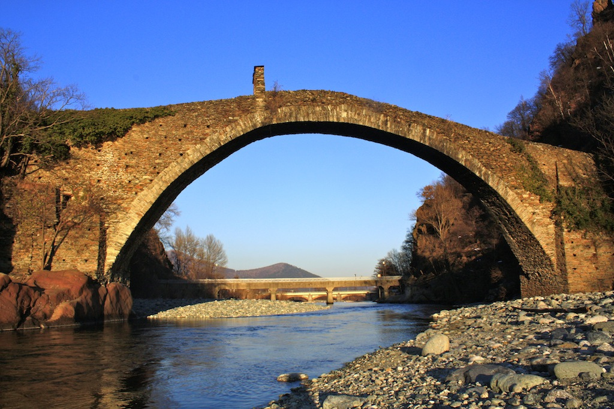

During my college years, a group of friends and I decided to visit the [Azar-Barzin-Mehr](https://en.wikipedia.org/wiki/Adur_Burzen-Mihr) fire temple, a site believed to have been built around 2,500 years ago. This fire temple was one of the three major fire temples in the ancient Persian Empire, where the sacred fire was said to have burned continuously for centuries.

We knew the temple was located on top of a mountain near a village, so we set off, hoping the villagers could guide us. Surprisingly, no one in the village had heard of Azar-Barzin-Mehr or the fire temple. Our hope began to fade until we met an old man who spoke of a "Devils' House." Intrigued, we asked him about it, and he described a structure that, according to local lore, could not be destroyed because it was built by the devil himself. We realized this must be the fire temple, its endurance through the ages giving it an almost supernatural reputation. With his help, we located the mountain and began our climb. It was challenging, but finally, we stood before the ancient temple, amazed by its strength and historical significance.

Recently, I came across a fascinating story about the [Devils' Bridges](https://en.wikipedia.org/wiki/Devil%27s_Bridge) in Europe. These ancient bridges, still standing and functional after centuries, are covered in mystery. Locals call them devil’s bridges, believing their construction to be beyond human ability, attributing them instead to the devil.

Both stories share a common theme: the incredible cleverness of ancient engineers. Whether it's the fire temple in Persia or the bridges in Europe, these structures resist time and doubt. The names of their creators may be lost to history, but their remarkable works continue to stand tall, drawing our attention and inspiring wonder.