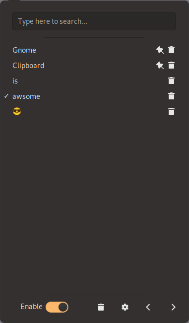

If you frequently work with clipboard content in Gnome and want a convenient way to manage it,
you can use the [Gnome Clipboard](https://github.com/b00f/gnome-clipboard) extension to manage the clipboard.

With the help of the Gnome Clipboard extension, you can manage the clipboard history.
You can pin important items, select specific ones, or remove items from the clipboard history.
You can also search for items easily in the clipboard history.

## Additional Features

- It's powered by TypeScript
- Clearing the clipboard history
- Set size for the clipboard history
- Read clipboard by timer instead of API
- Sorting clipboard items by "Copy time", "Recent usage" or "Most usage"
- Show a notification when selecting a clipboard item

## Installation

To install the latest release, visit Gnome Trash on the [Official GNOME Extensions](https://extensions.gnome.org/extension/4422/gnome-clipboard/) page.
